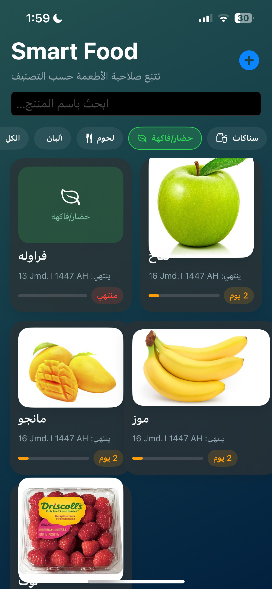
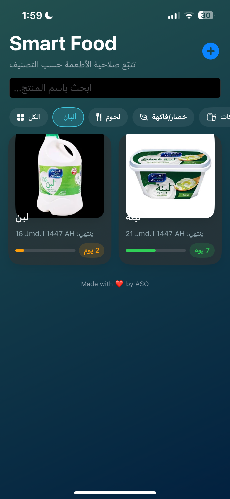

# SmartExpiryTracker

iOS application to track food expiry dates using **SwiftUI**.

---

## 🎯 About the App
SmartExpiryTracker يساعد المستخدم على تدوين تاريخ انتهاء المنتجات الغذائية وتنبيههم قبل انتهاء الصلاحية لتقليل الهدر والحفاظ على الصحة.

---

## 🛠️ Tech & Tools
| التقنية | الاستخدام |
|-------|-----------|
| SwiftUI | واجهة التطبيق |
| MVVM | تنظيم الكود |
| UserDefaults | حفظ بيانات المستخدم |
| Xcode | بيئة التطوير |

---

🎥 **Demo Video**

https://github.com/اسمك/SmartExpiryTracker/assets/XXXXXX/XXXXXXXX

---

## 📸 Screenshots

| الرئيسية | إضافة منتج | قائمة المنتجات |
|---------|-------------|----------------|
|  |  |  |

---

## 👩‍💻 Developer
Developed by **Aseel**.

---

## ✅ Features

---

Made with ❤️ by Aseel

- إضافة منتجات جديدة
- تحديد تاريخ الانتهاء
- عرض المنتجات حسب الأقرب انتهاءً
- تنبيهات لتجنب انتهاء صلاحية الطعام

---

## 🧱 Project Structure
